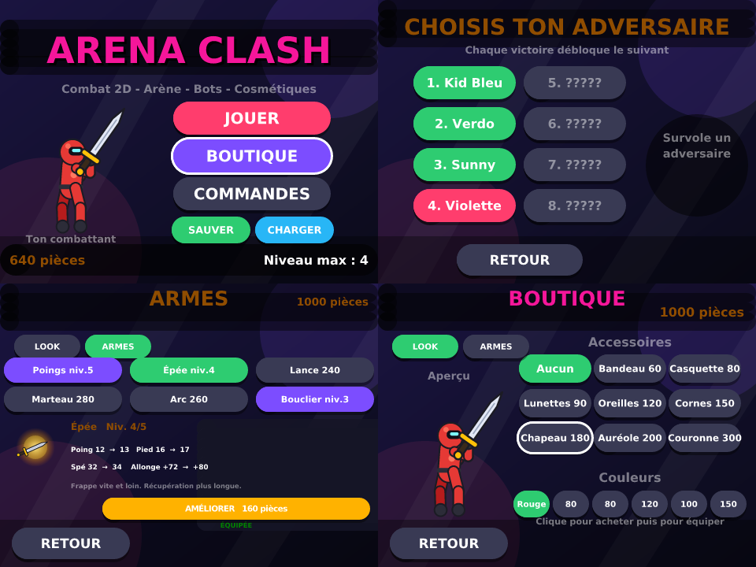

# ⚔️ Arena Clash — jeu de combat 2D pour Scratch 3

Un jeu de combat complet en **un seul fichier `.sb3`**, généré par script (Python → JSON Scratch),
avec des graphismes 100 % vectoriels, dessinés procéduralement.



## ▶️ Jouer

1. Télécharge **[`dist/ArenaClash.sb3`](dist/ArenaClash.sb3)**.
2. Va sur <https://scratch.mit.edu/projects/editor/> (ou ouvre l'appli Scratch 3 / TurboWarp).
3. **Fichier → Charger depuis votre ordinateur** → choisis `ArenaClash.sb3`.
4. Clique sur le drapeau vert 🟩.

> Fonctionne aussi dans TurboWarp (plus fluide) : <https://turbowarp.org/editor>

## 🎮 Commandes

| Touche | Action |
|---|---|
| ← / → | Se déplacer |
| ↑ | Sauter |
| ↓ | Garde (bloque ~90 % des dégâts, remplit la jauge spéciale) |
| ↓ **en l'air** | Garde aérienne : petit recul vers l'arrière. Résiste au coup de poing, mais **se brise sur un coup de pied ou un spécial** (moitié des dégâts + éjection) |
| J / K / L **en l'air** | Attaques aériennes (l'élan du saut est conservé) |
| **J** | Coup de poing — rapide, 7 dégâts |
| **K** | Coup de pied — plus lent, 11 dégâts, plus de portée |
| **L** | **SPÉCIAL** — 24 dégâts, disponible quand la barre bleue est pleine |

Un combat se joue **en 2 rounds gagnants** (max 3), 60 s par round. Au temps écoulé, celui qui a le plus de PV gagne le round.

## 🧩 Contenu

- **Menu** complet : Jouer / Boutique / Commandes, aperçu de ton combattant, pièces et progression.
- **8 bots de plus en plus forts** (PV, vitesse, agressivité, garde et temps de réaction croissants), chacun avec son look et son accessoire :
  `Kid Bleu → Verdo → Sunny → Violette → Cyan-X → Rosa → Ombre → Le Champion`.
  Chaque victoire débloque le suivant ; les bots verrouillés s'affichent « ????? ».
- **4 arènes** : Dojo, Toits de nuit, Volcan, Cyber.
- **Boutique de cosmétiques** : 8 accessoires de tête (bandeau, casquette, lunettes, oreilles de chat, cornes, haut-de-forme, auréole, couronne) + 6 couleurs de combattant. Les accessoires suivent la tête sur **toutes** les animations.
- **Sauvegarde de progression** : bouton *SAUVER* → code du type `5-01234-001-01-94-11` (niveau max, pièces, cosmétiques achetés et équipés, avec somme de contrôle) ; *CHARGER* → colle le code. Les codes invalides sont refusés.
- **Économie** : 100 pièces au départ, `40 + 30 × niveau` par victoire, 10 en cas de défaite.
- **Feeling de combat** : hit-stop, flash écran au K.O., étincelles, particules, effet de garde, combo compteur, anim. de victoire / K.O., 11 sons synthétisés.
- **Moteur de texte vectoriel** : la police (DejaVu Sans Bold, accents inclus) est embarquée sous forme de costumes SVG et tamponnée au stylo → texte net et aligné dans tous les menus.

## 🛠 Régénérer le projet

```bash
pip install fonttools
python3 scratch-game/build.py      # -> scratch-game/dist/ArenaClash.sb3
```

| Fichier | Rôle |
|---|---|
| `sb3lib.py` | mini-DSL Python → blocs Scratch 3 (`if_`, `repeat`, `define`/`call`, stylo, etc.) et assemblage du `.sb3` |
| `assets.py` | génération des SVG (combattant en 12 poses par cinématique directe, accessoires, décors, FX) et des sons WAV |
| `build.py` | tout le gameplay : machine d'états des combattants, IA des bots, HUD, menus, boutique, sauvegarde |
| `tools/` | harnais de test headless (`npm i` puis `node play.js ../dist/ArenaClash.sb3 t_air.json`) : rejoue un scénario dans la vraie VM Scratch et capture les écrans dans `tools/out/` |

Pour ajouter un bot ou un cosmétique, il suffit d'ajouter une ligne dans `BOTS`, `ACCS` ou `SKINS` dans `build.py`.

## ✅ Vérifications faites

- Le `.sb3` passe la validation officielle de `scratch-vm` (schéma SB3) et s'exécute sans erreur.
- Parcours testés en headless : menu → sélection → combat → K.O. → round 2 → victoire → pièces → déblocage → boutique (achat, équipement, « pas assez de pièces ») → commandes, ainsi que la défaite et la garde.
- Coût : ≈ 2–4 ms par image dans la VM (Scratch en autorise 33).
