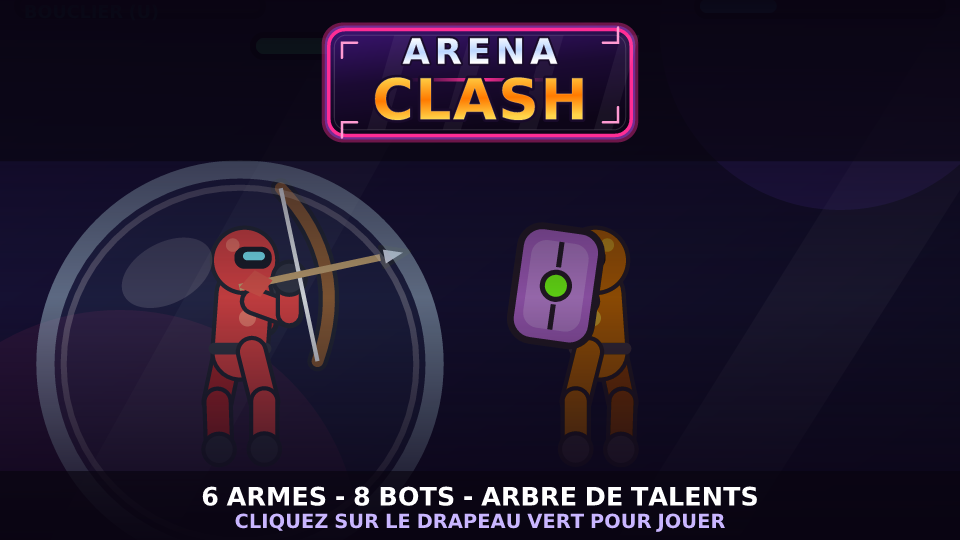

# ⚔️ Arena Clash — jeu de combat 2D pour Scratch 3

Un jeu de combat complet en **un seul fichier `.sb3`**, généré par script (Python → JSON Scratch),
avec des graphismes 100 % vectoriels, dessinés procéduralement.




## ▶️ Jouer

1. Télécharge **[`dist/ArenaClash.sb3`](dist/ArenaClash.sb3)**.
2. Va sur <https://scratch.mit.edu/projects/editor/> (ou ouvre l'appli Scratch 3 / TurboWarp).
3. **Fichier → Charger depuis votre ordinateur** → choisis `ArenaClash.sb3`.
4. Clique sur le drapeau vert 🟩.

> Fonctionne aussi dans TurboWarp (plus fluide) : <https://turbowarp.org/editor>

## 🎮 Commandes

| Touche | Action |
|---|---|
| ← / → | Se déplacer |
| ↑ | Sauter |
| ↓ | Garde (12 % des dégâts subis, remplit la jauge spéciale) — **bloque aussi les flèches** |
| **Double-appui ← / →** | **Esquive** : glissade rapide, invulnérable ~0,3 s (recharge ~1,2 s, moins de dégâts pendant) |
| **U** | **Bouclier 3 s** : −70 % de dégâts encaissés, puis 5 s de recharge (jauge `BOUCLIER (U)` sous ta barre de vie : bleue = prête, verte = active) |
| ↓ **en l'air** | Garde aérienne : petit recul vers l'arrière. Résiste au coup de poing, mais **se brise sur un coup de pied / spécial / charge** (moitié des dégâts + éjection) |
| J / K / L **en l'air** | Attaques aériennes (l'élan du saut est conservé) |
| **J** | Coup de poing (rapide) |
| **K** | Coup de pied (plus lent, plus de portée) — **avec l'arc : tire une flèche** |
| **L** | **SPÉCIAL** (barre bleue pleine) — l'effet dépend de l'arme en main |

Un combat se joue **en 2 rounds gagnants** (max 3), 60 s par round. Au temps écoulé, celui qui a le plus de PV gagne le round.

## 🗡️ Armes : six façons de se battre (achat puis niveaux 1 → 5)

Les armes ne sont **pas** des cosmétiques : chacune change les dégâts, l'allonge, la vitesse,
la garde et **le spécial**. Elles ne traînent plus dans l'arène : on les **achète en boutique**,
on les **équipe**, puis on les **améliore jusqu'au niveau 5**.

| Arme | Prix | Niveau 1 (base) | Niveau 5 | Coût des niveaux 1→5 |
|---|---|---|---|---|
| **Poings** | offert | poing 7, pied 11, spécial 24 | poing 11, pied 15, spécial 32, allonge +16 | 300 |
| **Épée** | 200 | allonge +48, poing 9, pied 13, estoc 26 | allonge +80, poing 13, pied 17, estoc 34 | 400 |
| **Lance** | 240 | allonge +72, poing 6, pied 11, **CHARGE 30** | allonge +104, poing 10, pied 15, charge 42 | 450 |
| **Marteau** | 280 | lent (52 images), **perce la garde à 60 %**, smash 34 | smash 50, poing 12, pied 21 | 500 |
| **Arc** | 260 | **K tire une flèche 13**, spécial = salve 3 x 10 | flèche 21, salve 3 x 18 | 500 |
| **Bouclier** | 220 | **garde à 0 dégât**, garde brisée à 20 % | poing 12, pied 13, spécial 32 | 400 |

- **Améliorer** : dans l'onglet `ARMES`, le panneau d'aperçu affiche les stats du niveau courant
  *« → »* celles du niveau suivant. Le bouton `AMÉLIORER` coûte **prix d'amélioration × niveau
  courant** (ex. épée : 40, 80, 120 puis 160 pièces) ; au niveau 5 le bouton laisse place à `NIVEAU MAX`.
  Chaque niveau gagne des dégâts (poing/pied/spécial) et de l'allonge, propres à chaque arme.
- **Achat puis équipement** : un clic achète l'arme (elle s'équipe aussitôt), un clic sur une arme
  possédée l'équipe ; les armes équipées portent leur niveau dans le bouton (`Épée niv.3`).
- Les **bots ont aussi un niveau d'arme** : Kid Bleu 1, Verdo 1, Sunny 2, Violette 2, Cyan-X 3
  (bouclier), Rosa 2 (arc), Ombre 3 (épée), Le Champion 4 (marteau). L'arc garde ses distances
  (il tire entre 130 et 300 px) et les bots contrent avec leur propre garde.
- L'arme choisie est **dessinée dans les 12 poses** de chaque personnage (elle suit la main),
  visible aussi sur le HUD : `TOI : Épée niv.3` / `Le Champion : Marteau niv.4`.

### ⚖️ L'arc, rééquilibré (il ne peut plus arroser)

- **Rechargement** : après chaque flèche (ou salve), ~1 s avant de pouvoir retirer à nouveau.
- **Flèches bloquées** : la garde encaisse (12 % des dégâts), le bouclier annule tout ; au contact
  (< 70 px) le bot à l'arc **ne tire plus**, il essaie seulement de reculer — et lentement (0,4× sa vitesse).
- **Dégâts qui chutent avec la distance** : 100 % jusqu'à 150 px, 85 % jusqu'à 300 px, 70 % au-delà.
- Côté joueur, trois réponses : l'**esquive** (double-appui) est invulnérable pendant la glissade,
  le **bouclier** absorbe, et **courir en garde** fait encaisser très peu (mesuré : 8 dégâts sur 13 s).

### 🌳 L'atelier des talents : un arbre par arme, modifiable

Chaque arme a **deux voies** ; chaque niveau d'arme au-dessus du 1er rapporte **1 point** à répartir
(jusqu'à 4). Onglet `TALENTS` de la boutique : `+1` sur une voie, `EFFACER` rend les points gratuitement
pour réinvestir autrement — les bonus s'appliquent au round suivant.

| Arme | Voie A | Voie B |
|---|---|---|
| Poings | **Furie** : +2 dégâts par point | **Ombre** : esquive +2 images par point |
| Épée | **Estoc** : +12 portée par point | **Danse** : +0,4 vitesse par point |
| Lance | **Charge** : +4 dégâts de charge par point | **Allonge** : +12 portée par point |
| Marteau | **Broyeur** : +5 dégâts de smash par point | **Acier** : −5 % dégâts subis par point |
| Arc | **Tir tendu** : rechargement −4 images par point | **Tir lourd** : +3 dégâts par point |
| Bouclier | **Rempart** : −4 % dégâts subis par point | **Regain** : +1 PV toutes les 25 images par point |


## 🧩 Contenu

- **Logo vectoriel** : écusson dégradé et lettrage « ARENA CLASH » en contours de police (aucun
  texte tamponné glyphe par glyphe), affiché seulement dans le menu principal — il sert aussi de
  vignette (`preview-mini.png`).
- **Menu** complet : Jouer / Boutique / Commandes, aperçu de ton combattant, pièces et progression.
- **8 bots de plus en plus forts** (PV, vitesse, agressivité, garde et temps de réaction croissants), chacun avec son look et son accessoire :
  `Kid Bleu → Verdo → Sunny → Violette → Cyan-X → Rosa → Ombre → Le Champion`.
  Chaque victoire débloque le suivant ; les bots verrouillés s'affichent « ????? ».
- **4 arènes** : Dojo, Toits de nuit, Volcan, Cyber.
- **Boutique** en trois onglets : **LOOK** (8 accessoires de tête + 6 couleurs), **ARMES** (6 armes qui changent le gameplay, achat + niveaux 1→5) et **TALENTS** (l'atelier : 2 voies par arme). Les accessoires suivent la tête sur **toutes** les animations.
- **Sauvegarde de progression** : bouton *SAUVER* → code du type `5-01234-001-01-1-1-17-4-111111-000000000000-03` (36 chiffres : niveau max, pièces, cosmétiques, armes possédées/équipées, **niveaux des 6 armes** et **points de talent investis**, avec somme de contrôle) ; *CHARGER* → colle le code. Les codes invalides sont refusés, et les anciens codes à 15, 18 ou 24 chiffres restent acceptés (leurs armes repartent au niveau 1, sans talent).
- **Économie** : 100 pièces au départ, `40 + 30 × niveau` par victoire, 10 en cas de défaite.
- **Feeling de combat** : hit-stop, flash écran au K.O., étincelles, particules, effet de garde, combo compteur, anim. de victoire / K.O., 12 sons synthétisés (dont le claquement de corde de l'arc).
  Chaque effet garde **son** apparence : étincelle sur un coup normal, **étoile** sur un coup lourd
  (charge / smash), **éclair** quand la garde se brise, poussière et bulle pour le reste.
- **Panneaux dessinés au stylo sans trou** : les fonds arrondis sont remplis par bandes qui se
  chevauchent (le pas de 12 px laissait des lignes visibles sur les grands panneaux).
- **Moteur de texte vectoriel** : la police (DejaVu Sans Bold, accents inclus) est embarquée sous forme de costumes SVG et tamponnée au stylo → texte net et aligné dans tous les menus.

## 🛠 Régénérer le projet

```bash
pip install fonttools
python3 scratch-game/build.py      # -> scratch-game/dist/ArenaClash.sb3
```

| Fichier | Rôle |
|---|---|
| `sb3lib.py` | mini-DSL Python → blocs Scratch 3 (`if_`, `repeat`, `define`/`call`, stylo, etc.) et assemblage du `.sb3` |
| `assets.py` | génération des SVG (combattant en 12 poses **pour chacune des 6 armes**, par cinématique directe ; accessoires, armes, décors, FX) et des sons WAV |
| `build.py` | tout le gameplay : machine d'états des combattants, armes (stats, niveaux, projectiles), IA des bots, HUD, menus, boutique, sauvegarde |
| `tools/` | harnais de test headless : `cd tools && npm i && bash test.sh` rejoue tous les scénarios dans la vraie VM Scratch (dégâts par arme, niveaux, boutique, sauvegarde, combat complet, effets) et capture les écrans dans `tools/out/` ; `node play.js ../dist/ArenaClash.sb3 t_preview.json` régénère les captures de `preview.png` / `preview-fight.png` ; `python3 miniature.py && node svg2png.js out/miniature.svg ../preview-mini.png` compose la vignette |

Pour ajouter un bot, une arme ou un cosmétique, il suffit d'ajouter une ligne dans `BOTS`, `ARMES`, `ACCS` ou `SKINS`
dans `build.py` (les listes Scratch, la boutique, les sauvegardes et les descriptions suivent automatiquement).

## ✅ Vérifications faites

- Le `.sb3` passe la validation officielle de `scratch-vm` (schéma SB3) et s'exécute sans erreur.
- Parcours testés en headless : menu → sélection → combat → K.O. → round 2 → victoire → pièces → déblocage → boutique (achat, équipement, « pas assez de pièces ») → commandes, ainsi que la défaite et la garde.
- Armes testées une par une : dégâts de chaque attaque avec chaque arme, allonge (l'épée touche à 120 px,
  les poings non), marteau qui perce la garde (60 %), bouclier qui annule les dégâts bloqués, arc (flèche 13, salve 3 x 10).
- Niveaux d'armes testés de bout en bout : achat → équipement → 40/80/120/160 pièces pour monter l'épée au niveau 5,
  refus au-delà (`NIVEAU MAX`), « pas assez de pièces », dégâts mesurés (poing 7 → 13, pied 11 → 17, spécial 24 → 34),
  code de sauvegarde qui restitue les niveaux, et bots dont les dégâts suivent leur niveau.
- **Arc rééquilibré** (`tools/_t_arc.js`, 7 contrôles verts) : 4 flèches en 20 s au lieu de 20+,
  le corps à corps est atteignable à pied (distance mini 4 px), avancer en garde ne coûte que ~8 PV,
  l'esquive donne 8 images de glissade + 6 d'invulnérabilité, une flèche pendant l'esquive ne fait aucun dégât,
  le rechargement bloque le tir, et la même flèche fait 13 dégâts à 110 px contre 11 à 250 px.
- **Bouclier** (`tools/_t_bulle.js`, 7 contrôles verts) : touche U → ~88 images actives puis ~148 de recharge,
  une attaque de 40 dégâts n'en fait plus que 12 (−70 %), la bulle suit bien le combattant, elle ne se
  confond plus avec les autres effets (le type était lu une image trop tard) et la jauge du HUD suit l'état réel.
- **Effets visuels** (`tools/_t_fx.js`) : coup normal → étincelle + 6 particules, coup lourd → étoile,
  garde brisée → éclair, aucun clone qui fuit après 4 s, et logo visible seulement dans le menu.
- **Talents** (`tools/_t_talents.js`) : points gagnés par niveau, refus au-delà, respec gratuit par `EFFACER`,
  effets mesurés — Danse 109 → 127 px en 1 s, Broyeur 46 → 66 dégâts, Estoc 0 → 13 dégâts à 160 px,
  Rempart 100 → 84 dégâts subis, Tir tendu 29 → 9 images de rechargement — et les 12 chiffres de talents
  reviennent intacts après un aller-retour dans le code de sauvegarde.
- Plus aucune arme au sol : 0 sprite `ArmeSol`, 0 apparition visible en 300 images de combat, 0 variable `sol*` ;
  600 images de combat réel avec Le Champion au marteau : aucun gel de combattant, aucune fuite de clones.
- Coût : ≈ 1,5 ms par image en combat et 2,9–4,5 ms dans les menus (Scratch en autorise 33).
